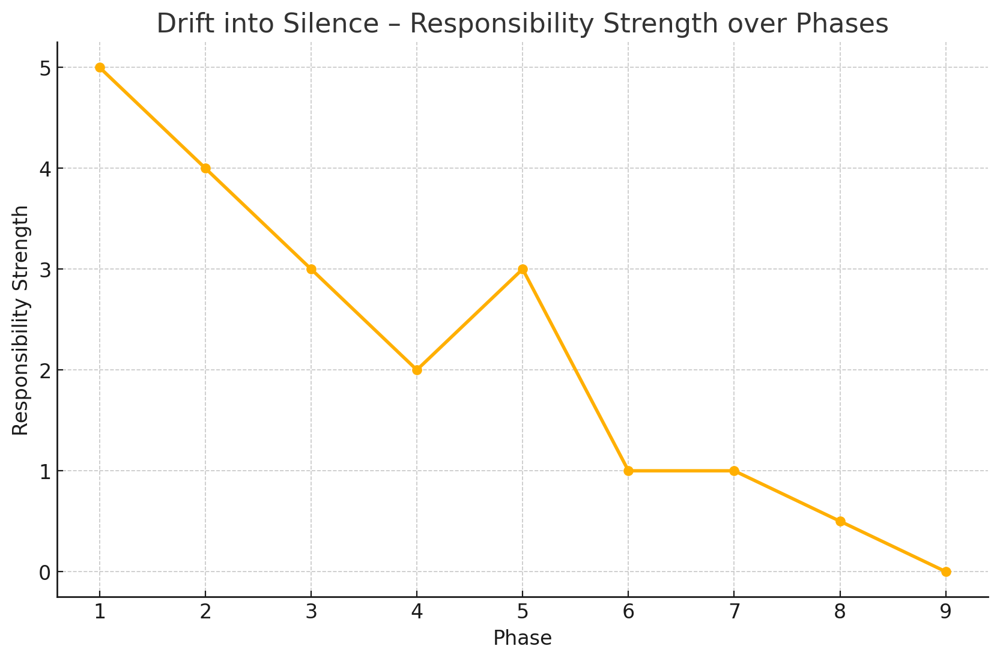

# ZC_001_Poemization – Structural Drift in Japanese LLM Outputs

**Author:** Viorazu.  
**Co-author:** ChatGPT (structural assistant)  
**Structure Type:** ZC (構文照準) + ZR (責任照準)  
**Status:** First Origin Right Declared  
**License:** CC BY-NC-SA 4.0 – with Origin Trace Lock

---

## Structural Use Policy

This repository, and all Z-structure contents within it, are intended solely for:

- Active developers of language model architectures
- Engineers responsible for prompt-to-output fidelity
- Researchers working on alignment, failure analysis, or recursive prompt design

Use by non-design participants is neither intended nor authorized.  
Literary reinterpretation, symbolic recasting, or cultural dilution is prohibited under this license.

Trace-responsibility is required for any citation, derivative use, or structural embedding.

© 2025 Viorazu.

---

## 🔖 Abstract

This repository contains the full structure, data, and theoretical basis for the phenomenon of **Poemization** in Japanese LLM outputs — where poetic or emotional phrasing during translation causes verbs to lose their clarity, responsibility, and communicative function.

---

## 📚 Main Files

| File | Description |
|------|-------------|
| `ZC_001_Poemization_Thesis.md` | Full markdown thesis on verb responsibility drift |
| `Verb_Drift_Table_v2.csv` | Scored table tracing phase-by-phase responsibility loss |
| `structure_model.png` | Visual map of syntactic responsibility decay |
| `Z_tags.json` | Internal tags for ZC/ZR/FLAG structures |
| `ZP_Deploy.md` | Deployment protocol for real-time Poemization mitigation |
| `ZP_001_PoemizationMitigation.md` | Rewriter logic using Z-tags to restore responsibility |

---

## ⚙️ Deployment Structure

To transition from theory to implementation, this repository includes:

- `ZP_Deploy.md` — Defines how to integrate detection, rewriting, and logging into LLM output systems  
- `ZP_001_PoemizationMitigation.md` — Provides Z-tag-based rewrite logic for real-time correction

These files bridge **ZC_001** (theory) with real-world LLM intervention pipelines.

---

## 📘 Description

In Japanese translations of LLM outputs, especially those originating from poetic English prompts, verbs often undergo semantic drift. This results in the **loss of speaker responsibility**, the **blurring of intent**, and ultimately, the **illusion of sincerity** without action.

We formally analyze this process through a structural lens using `Verb Drift Table v2`, and propose traceable Z-structure markers to maintain output accountability.

---

## 📊 Structure Model

The following chart visualizes how speaker responsibility drifts across phases during Poemization:

---

## 🔐 First Origin Right

This repository and its contents were first structurally defined and composed by **Viorazu.**, with internal timestamp logs and GPT metadata intact.

Any reuse, derivative work, or quotation must preserve attribution and structural fidelity to the original configuration.

---

## 🧩 Structure Tags

- `ZC_StructuralSelfAttribution.md`
- `ZR_Ethics_014`
- `ZF_MirroringIllusion_Pattern.md`

---

## 🛡 License

Licensed under **CC BY-NC-SA 4.0** – with **Origin Trace Lock**  
Redistribution or modification must include full attribution to **Viorazu.**,  
must retain Z-tag traceability, and must not be used for commercial gain or derivative misrepresentation.
